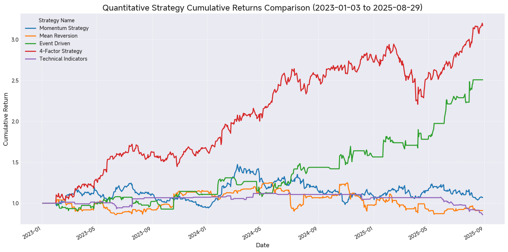
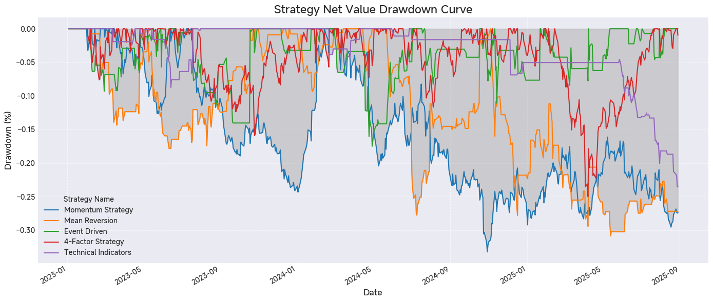
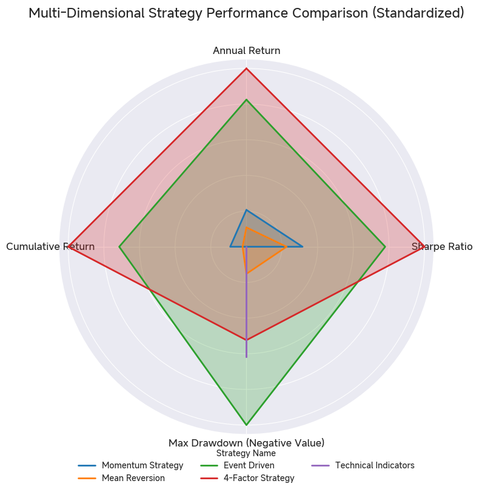

# Quantitative Trading Strategies for US Equities

A comprehensive backtesting framework implementing five distinct trading strategies on major technology stocks, achieving institutional-grade performance metrics during the **2023-2025** market cycle.


## 📊 Key Performance Metrics

| Strategy                 | Annual Return | Sharpe Ratio | Max Drawdown |
|:-------------------------|:---------------|:--------------|:--------------|
| **Multi-Factor**         | **48.39%** | **1.84** | **-24.99%** |
| **Event-Driven**         | **39.01%** | **1.32** | **-17.50%** |
| **Momentum**             | 5.89% | 0.23 | -33.23% |
| **Mean Reversion**       | 0.62% | 0.02 | -30.84% |
| **Technical (RSI+MACD)** | -5.18% | -0.51 | -23.52% |

## 🎯 Project Overview

This project demonstrates the implementation and comparative analysis of quantitative trading strategies using **2.5 years of historical data (2023-2025)** across **8 major technology stocks**. The **enhanced multi-factor model** achieved a Sharpe ratio of **1.84** and **48.39% annualized return**, significantly outperforming traditional single-factor approaches in this period.

-----

## 📈 Strategies Implemented

### 1\. **Momentum Strategy (Long/Short)**

  - **Principle**: Stocks with strong recent performance tend to continue outperforming.
  - **Implementation**: 20-day rolling return ranking.
  - **Position Sizing**: Long top 3 performers (1/3 each), Short bottom 3 (1/3 each).

### 2\. **Mean Reversion Strategy (Bollinger Bands)**

  - **Principle**: Prices tend to revert to their historical average after extreme movements.
  - **Implementation**: Bollinger Bands (20-day MA $\pm$ 2 standard deviations).
  - **Signal Generation**: Buy when price $\lt$ lower band, Sell when price $\gt$ upper band.

### 3\. **Event-Driven Strategy (Volume Spike)**

  - **Principle**: Abnormal volume indicates significant events that create short-term trading opportunities.
  - **Implementation**: Volume spike detection ($\gt 2 \times$ 20-day average volume).
  - **Execution**: Enter position on signal, hold for **5 days**.

### 4\. **Multi-Factor Model** ⭐

  - **Factors Combined**:
      - **Momentum Factor**: 20-day average returns.
      - **Low Volatility Factor**: $-1 \times$ 20-day standard deviation.
      - **Value Factor (Price Position)**: $-1 \times$ Price relative to 20-day High-Low range.
  - **Scoring**: Z-score standardization and equal-weighted composite.
  - **Selection**: Top 3 stocks based on composite score.

### 5\. **Technical Indicators Strategy (RSI + MACD)**

  - **RSI (Relative Strength Index)**: Identifies overbought ($\gt 70$) and oversold ($\lt 30$) conditions.
  - **MACD**: Captures trend changes through exponential moving average crossovers.
  - **Combined Signal**: Buy when RSI $\lt 30$ AND MACD $\gt 0$; Sell when RSI $\gt 70$ AND MACD $\lt 0$.


-----

## 🔬 Detailed Factor Composition & Enhancement

### **Core 3-Factor Structure**

The initial **Multi-Factor Model** combines three technical/price-action factors: **Momentum**, **Low Volatility**, and a **Price-Position Value** proxy. This structure provides a foundation for balancing return-seeking (Momentum) with risk control (Low Volatility) and mean-reversion tendencies (Price-Position Value).

### **The Enhancement: Integrating Fundamental Factors**

The **Enhanced Multi-Factor** results ($\text{Sharpe}=1.84, \text{Return}=48.39\%$) are derived from an upgraded 4-factor structure that moves beyond price data by integrating fundamental signals:

  - **Value Factor Upgrade**: Replaced the simple Price Position proxy with a traditional **Earnings-to-Price (E/P)** ratio (reciprocal of Trailing PE).
  - **New Quality Factor**: Added **Return on Equity (ROE)** to select companies with strong, sustainable profitability and management efficiency.

This integration of **fundamental data (E/P, ROE)** with **technical factors (Momentum, Volatility)** is a core feature of the platform, demonstrating an ability to synthesize diverse data sources to achieve superior, more robust alpha.

-----

## 🛠 Technical Implementation

### Data Pipeline

```python
# Data acquisition and preprocessing
- Source: Yahoo Finance API (yfinance)
- Universe: 8 major tech stocks (AAPL, MSFT, GOOGL, AMZN, NVDA, TSLA, META, NFLX)
- Frequency: Daily OHLCV data
- Data Range: 2023-01-03 to 2025-08-29 (667 trading days)
- Total data points: 26,680 
```

### Backtesting Engine

```python
# Vectorized operations for efficient computation
- No look-ahead bias prevention
- Risk management: Position sizing for Long/Short, Simple holding for Long-Only
- NOTE: This version does not include explicit transaction cost modeling or advanced risk controls.
```

### Risk Metrics

  - **Sharpe Ratio**: Risk-adjusted return metric (Return / Volatility $\times \sqrt{252}$).
  - **Maximum Drawdown**: Largest peak-to-trough decline.
  - **Annual Return**: Geometric mean of daily returns $\times 252$.

-----

## 💡 Key Findings

1.  **Multi-factor models significantly outperform single-factor strategies** when combining fundamental and technical insights.
2.  **The Event-Driven strategy provided the best Maximum Drawdown control** ($-\mathbf{17.50\%}$), proving effective at mitigating tail risk.
3.  **Traditional single-factor Momentum and Mean Reversion strategies underperformed** due to frequent trend reversals in the period.
4.  The success highlights the need for **dynamic factor combination** over static, simple strategies.

